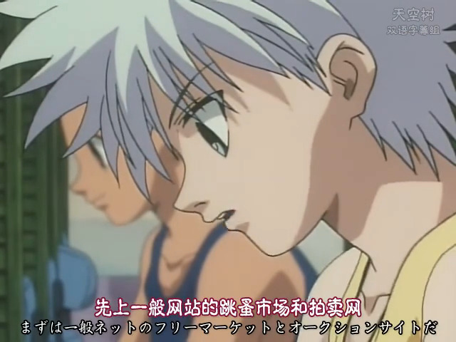

# Hunter x Hunter '99 jp subs

OCR version extracted from bilibili: 【DVDRip】1999年版 全职猎人 TV版62集全【天空树双语字幕】using [VideoOCR](github.com/timminator/VideOCR)

Whisper version made from the audio of HxH99 Remastered version provided by the hxh99 discord

They still have errors so contributions are welcome. There are some mistakes even on the source video. The better of the two versions is clearly the OCR one, but it has lots of minor mistakes like オレ written multiple times as 才レ or, also recurrent 絶対 as 绝対

